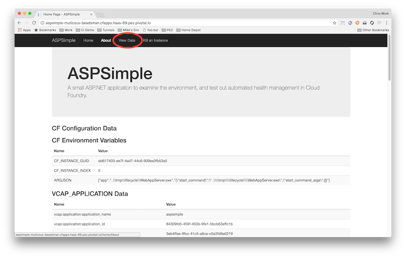

= Lab 2 - Binding Services to your .NET 4.5 Application

== Assumptions

. This lab assumes you have completed Lab 1, and successfully pushed the ASPSimple application.  If you haven't done that, please go back to Lab 1 and complete that first.

== What Services are out there?

. Let's check what services are available in our Cloud Foundry already by using the `cf marketplace` command.  The Marketplace lists all the brokered services that the platform knows about, and their lifecycle is automated for us.
+
----
c:\ASPSimple\ASPSimple\bin\published>cf marketplace
----
+
You should see output similar to the following listing.
+
----
Getting services from marketplace in org instructor / space development as admin...
OK

service                       plans                     description
app-autoscaler                bronze, gold              Scales bound applications in response to load (beta)
mssql-dev                     dev                       Microsoft SQL Server service for application development and testing
p-circuit-breaker-dashboard   standard                  Circuit Breaker Dashboard for Spring Cloud Applications
p-config-server               standard                  Config Server for Spring Cloud Applications
p-mysql                       100mb                     MySQL databases on demand
p-rabbitmq                    standard                  RabbitMQ is a robust and scalable high-performance multi-protocol messaging broker.
p-redis                       shared-vm, dedicated-vm   Redis service to provide a key-value store
p-service-registry            standard                  Service Registry for Spring Cloud Applications

TIP:  Use 'cf marketplace -s SERVICE' to view descriptions of individual plans of a given service.
----

. The ASPSimple app works with MS SQL Server, so let's get more information about that mssql-dev service using the suggestion at the end of the output.
+
----
c:\ASPSimple\ASPSimple\bin\published>cf marketplace -s mssql-dev
----
+
You should see something like the following listing.
+
----
Getting service plan information for service mssql-dev as admin...
OK

service plan   description         free or paid
dev            Shared SQL Server   free
----

. Free is good right?  Note the names of the service and the plan we've chosen, as well use those in the next section.

== Create a Service Instance

. Now that we've chosen a service type and plan that we are willing to pay for, let's create an instance of that service with the `cf create-service` command.
+
----
c:\ASPSimple\ASPSimple\bin\published>cf create-service mssql-dev dev mydb
----
+
You should see the following output.
+
----
Creating service instance mydb in org instructor / space development as admin...

OK
----

. Great we have our own service instance of MS SQL Server!  Now, let's let our app know about that service instance so it can use it.

== Bind the Service Instance to our app

. Now, let's let our ASPSimple app know about the database we have now.  Cloud Foundry calls this "binding" a service instance to an application.
+
----
c:\ASPSimple\ASPSimple\bin\published>cf bind-service aspsimple mydb
----
+
And we see the following.
+
----
Binding service mydb to app aspsimple in org instructor / space development as admin...
OK
TIP: Use 'cf restage aspsimple' to ensure your env variable changes take effect
----

. Did you see that tip at the end of the output about restaging?  Your instructor has probably told you about the staging process.  We'll follow that advice in the next section to make sure our app gets all the info about our new service.

== Restage the app

. The platform recommends that we restage our app after binding a service because it has no idea what the service does or affects.  Restaging allows the platform to rebuild the container and allow any buildpack actions to consider the new service.  In our case, the service isn't utilized by the buildpack process, but we'll restage anyway as its a good habit if you don't fully understand how the service interacts with buildpacks.
+
----
c:\ASPSimple\ASPSimple\bin\published>cf restage aspsimple
----
+
And we a lot of the same output we saw from the initial push process.
+
[subs="attributes"]
----
Restaging app aspsimple in org instructor / space development as admin...
Downloading binary_buildpack...
Creating container
Downloaded binary_buildpack
Successfully created container
Downloading app package...
Downloaded app package (6.3M)
Downloading build artifacts cache...
Staging...
Downloaded build artifacts cache (88B)
Exit status 0
Staging complete
Uploading droplet, build artifacts cache...
Uploading build artifacts cache...
Uploading droplet...
Uploaded build artifacts cache (114B)
Destroying container
Successfully destroyed container

0 of 1 instances running, 1 starting
1 of 1 instances running

App started

OK

App aspsimple was started using this command `..\tmp\lifecycle\WebAppServer.exe`

Showing health and status for app aspsimple in org instructor / space development as admin...
OK

requested state: started
instances: 1/1
usage: 384M x 1 instances
urls: aspsimple-muticous-beadsman.{appsdomain}
last uploaded: Mon Nov 28 22:00:10 UTC 2016
stack: windows2012R2
buildpack: binary_buildpack

     state     since                    cpu    memory           disk          details
#0   running   2016-11-28 06:00:26 PM   0.1%   171.4M of 384M   21.6M of 1G
----

== Validate the DB is Connected

. Now that the app is restaged, navigate to the URL referenced in the output in your web browser.
+

. Notice that there is a new link in the UI to View Data.  Click that link.  In the resulting page, fill out the first name and last name fields, leaving the Id field with only it's place holder showing, and then click the Insert/Update button.

. Now restart the application using the `cf restart` command
+
----
c:\ASPSimple\ASPSimple\bin\published>cf restart aspsimple
----

. Now, refresh the "View Data" page for the app and you should still see the row we inserted earlier.  Your data is safe in the DB.

== Explore the Code

. Open up the solution in Visual Studio, and take a look at the Global.asax file.  Explore the ServerConfig class in the RegisterConfig method, and CloudFoundryServices properties to see how we use the Steeltoe project to extract service information from the application's Environment, and then look at DbConfig.Update to see how we find specific services we're looking for.
