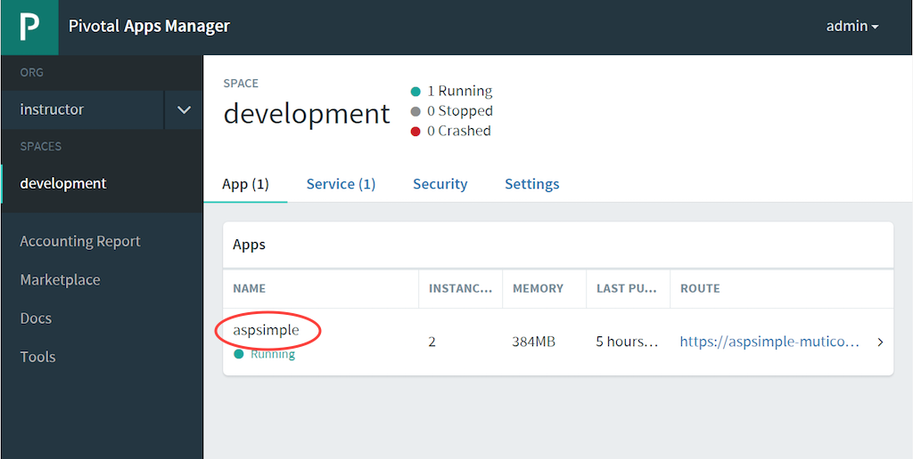
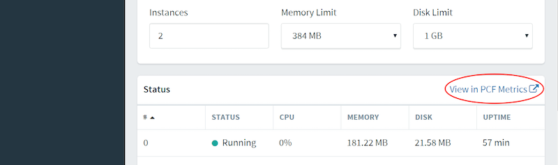
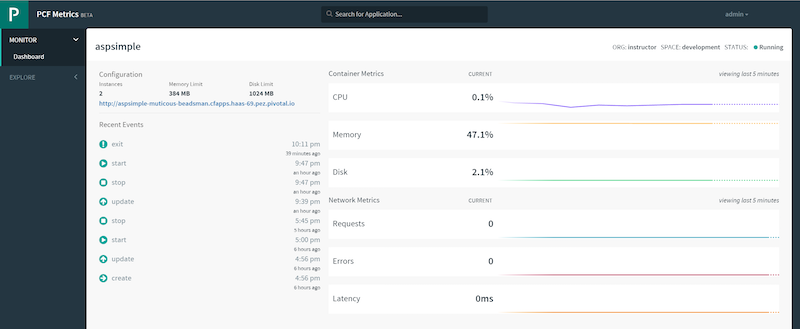
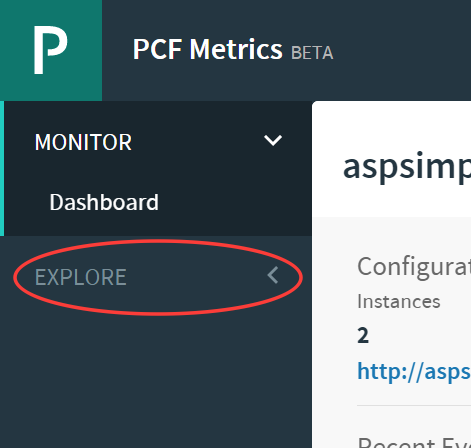
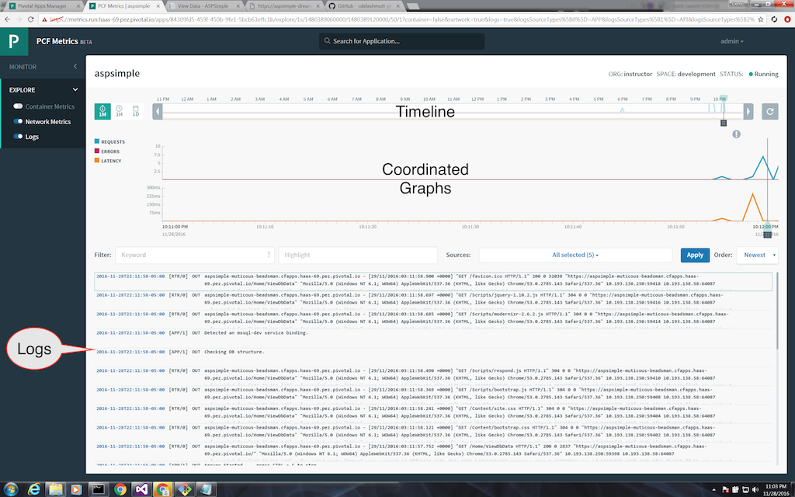
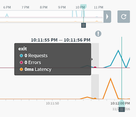

= Lab 4 - Monitoring .NET 4.5 Application

== Assumptions

. This lab assumes you have completed Lab 3, and have scaled your application to 2 instances.  If you haven't done that, please go back to Lab 3 and complete that first.

== Checking Events

. Major events in your applications lifecycle are audited by the platform.  Starts, stops, updates, routes, and pretty much anything that affects the state of the app from a platform perspective are tracked.  We can use the `cf events` command to see them.  Call that command now.
+
----
c:\ASPSimple\ASPSimple\bin\published>cf events aspsimple
----
+
Output looks similar to the below:
+
----
Getting events for app aspsimple in org instructor / space development as admin...

time                          event                 actor   description
2016-11-28T21:39:53.00-0500   audit.app.update      admin   instances: 2
2016-11-28T18:00:02.00-0500   audit.app.restage     admin
2016-11-28T17:45:43.00-0500   audit.app.update      admin   state: STOPPED
2016-11-28T17:00:39.00-0500   audit.app.update      admin   state: STARTED
2016-11-28T16:56:44.00-0500   audit.app.update      admin
2016-11-28T16:56:44.00-0500   audit.app.map-route   admin
2016-11-28T16:56:39.00-0500   audit.app.create      admin   instances: 1, memory: 384, state: STOPPED, environment_json: PRIVATE DATA HIDDEN
----

. Now, let's restart the app and see what that does to the events.  Use the `cf restart` command, and then view the output from `cf events`.  Notice that we see that the app moved to a `STOPPED` state and back to a `STARTED` state.  Also, these events are for the application as a whole, and not just a single instance of your app.

== Viewing log streams

. You can view a set of the recent log entries for your applications with the `cf logs` command.  Let's dump out the logs for aspsimple.
+
----
c:\ASPSimple\ASPSimple\bin\published>cf logs aspsimple --recent
----

. You can also get a live stream of log events for your application by omiting the `--recent` from the command.  Let's try this out starting the stream in your command prompt.
+
----
c:\ASPSimple\ASPSimple\bin\published>cf logs aspsimple
----

. Next, move the command prompt window and brower window so you can see both.  Make a few requests to your application via the browser, and notice the logs streaming in via the command prompt.

== Big Brother is Watching

. The platform itself is _also_ monitoring your apps.  It is watching them not just for audit purposes, but also to make sure that when you say you want 2 instances, that your two instances are running until you tell the platform to stop them.  Let's test this out!

. If you look at the menu bar for your web application, you've probably seen this link that has been calling out to you to click it labeled "Kill an Instance".  Click that link.  You might not have noticed much, but if you still had your command prompt visible that was streaming the log output from you apps, you probably saw a lot of stuff flash by in that window with output similar to the following:
+
----
2016-11-28T22:11:52.64-0500 [RTR/0]      OUT aspsimple-muticous-beadsman.{apps-domain} - [29/11/2016:03:11:54.952 +0000] "POST /Home/Kill HTTP/1.1" 502 0 67 "https://aspsimple-muticous-beadsman.{apps-domain}/Home/ViewDbData" "Mozilla/5.0 (Windows NT 6.1; WOW64) AppleWebKit/537.36 (KHTML, like Gecko) Chrome/53.0.2785.143 Safari/537.36" 10.193.138.250:59384 10.193.138.57:63515 x_forwarded_for:"107.77.216.140" x_forwarded_proto:"https" vcap_request_id:6072b1f8-ca1a-4243-74c7-9aa1731c499a response_time:0.029250381 app_id:84309fd5-459f-450b-9fe1-5bcb63effc1b app_index:1
2016-11-28T22:11:52.67-0500 [APP/1]      OUT Faster Pussycat! Kill! Kill!
2016-11-28T22:11:52.72-0500 [APP/1]      OUT Exit status -1
2016-11-28T22:11:52.79-0500 [CELL/1]     OUT Exit status -26
2016-11-28T22:11:52.79-0500 [CELL/1]     OUT Destroying container
2016-11-28T22:11:52.82-0500 [CELL/1]     OUT Creating container
2016-11-28T22:11:55.10-0500 [API/0]      OUT App instance exited with guid 84309fd5-459f-450b-9fe1-5bcb63effc1b payload: {"instance"=>"", "index"=>1, "reason"=>"CRASHED", "exit_description"=>"2 error(s) occurred:\n\n* 2 error(s) occurred:\n\n* Exited with status -1\n*cancelled\n* cancelled", "crash_count"=>1, "crash_timestamp"=>1480389115076168461, "version"=>"7107db82-e9d5-4eb7-9212-aadf4c718e25"}
2016-11-28T22:11:53.22-0500 [CELL/1]     OUT Successfully destroyed container
2016-11-28T22:11:53.64-0500 [CELL/1]     OUT Successfully created container
2016-11-28T22:11:55.02-0500 [CELL/1]     OUT Starting health monitoring of container
2016-11-28T22:11:55.27-0500 [APP/1]      OUT Running ..\tmp\lifecycle\WebAppServer.exe
2016-11-28T22:11:55.35-0500 [APP/1]      OUT 2016-11-29 03:11:55Z|INFO|Port:51066
2016-11-28T22:11:55.35-0500 [APP/1]      OUT PORT == 51066
2016-11-28T22:11:55.35-0500 [APP/1]      OUT 2016-11-29 03:11:55Z|INFO|Webroot:C:\containerizer\E7997F5C3ECF70D22E\user\app
2016-11-28T22:11:55.37-0500 [APP/1]      OUT 2016-11-29 03:11:55Z|INFO|Starting web server instance...
2016-11-28T22:11:55.64-0500 [APP/1]      OUT Server Started.... press CTRL + C to stop
----
+
What happened here?  Well, the "Kill an Instance" link makes a POST via Javascript to the HomeController's Kill method.  This method causes an abnormal stop of the app using `Environment.Exit`.  But in short order, the platform detected that an instance was abnormally terminated and quickly restarted it.

== Apps Manager
. If you prefer, you can use the Pivotal Apps Manager web interface to view the events and logs for your application.  Navigate to https://apps.{system-domain}, and login with your credentials.

. Next, click on the title for your application.
+

. From the "Overview" tab for the app (the default), you can see all the recent events for your app.  You should see the "Crashed" event from when we just killed the app.  Kill the app again if you want to see a new "Crashed" event show up here.  You should also see that this is a live view, and that the status of failed instance changed to a red "Crashed" status in the UI.  You can wait until the failed app instance comes back online to move to the next step.

. Take a moment to explore some of the other tabs for your application in Apps Manager.  You should see that a lot of the CLI functions are replicated in the web UI as well, so you can use this interface to monitor your applications if you prefer.

== PCF Metrics
. You can view metrics, logs, and events in a unified interface called PCF Metrics.  If you navigate back to the details for your application in Apps Manager, on the "Overview" tab in the section titled "Status" you should see a link to "View in PCF Metrics".  Click this link to access PCF Metrics.
+

. You may be prompted to authenticate again.  Just use your assigned credentials to login to the PCF Metrics interface.

. You will be placed in the Dashboard view for your application.  This view will allow you to monitor the resource consumption for your app nearly live.
+

. Try making some requests to your application in a different tab, and then come back to your PCF Metrics Dashboard view to see those statistics change based on your requests.  You should see the "Requests" metric change as you were making requests.

. Next, click on the "Explore" section of PCF Metrics.
+

. In the "Explore" section, you can explore historical information collected about your application.  You can quickly adjust the time range you are viewing to a 1 minute, 1 hour, and 1 day interval by clicking the buttons to the left of the timeline.  If you don't see any interesting data in the coordinate graphs, click the "1 hour" time interval, and slide the view range in the top timeline view until you see some interesting spikes you want to explore.  Likely the spikes nearest to the current time will show some interesting features to explore so try to find those.
+

. Hopefully, you'll be looking at a range that has some spikes and grey icons above the graph.  The grey icons coorespond to the application events we were looking at in the first part of this lab.  Hover your mouse under those grey icons and you should see more detailed information about that slice of time.  Notice in the popup, you'll see information about the events that occured in that time slice, as well as a summary of the metrics in that time slice.
+

. If you notice in that same section of the coordinated graphs, there is another slider bar that you can move.  This bar scrubs the log view below to the cooresponding log entries for the position of the slider.  Try moving the log view using the slider, and then scroll the log list up and down.  Notice, the scroll position, and they slider bar stay coordinated.

. Next, we can use the filter bar above the log view to quickly find log entries.  Let's look for the message that app emits when it kills an instance.  If you type "Kill" into the Filter text box with the "Keyword" placeholder, and press enter, you can quickly filter the log entries list down to just the entries that contain the word "Kill" in them.  If you don't see any log entries, then you can adjust the viewing range and move the timeline slider around until you see some.

. We're looking for the specific log message, though, so we might want to Highlight the entries that contain the work "Faster" in them to futher set them apart in the list, but not change our filtered set.  If we click on the box with the "Highlight" placeholder text in it, type "Faster" and press enter, then you should see the log message that the app emitted when it killed an instance.
